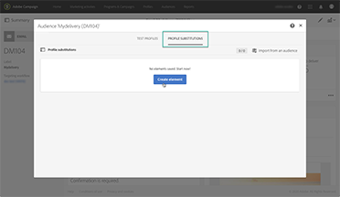
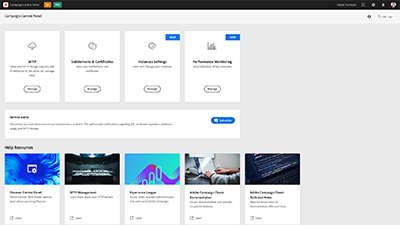
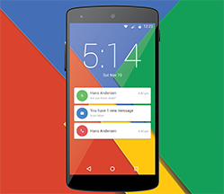

# Adobe Campaign Standard – Tutorials

Adobe Campaign bietet eine Plattform zur Konzeption kanalübergreifender Kundenerlebnisse und stellt dazu eine Umgebung für die visuelle Kampagnenorchestrierung, die Echtzeit-Interaktionsverwaltung und die Cross-channel Execution bereit. Dieses Benutzerhandbuch enthält Videos und Tutorials zu den zahlreichen Funktionen von Adobe Campaign Standard.

## Favoriten unserer Mitarbeiter

<table>
<tr>
  <td>
    
    

      <a href="./communication-channels/email/profile-substitution.md">
    <strong>Profilersetzung - Testen von E-Mail-Nachrichten mithilfe von Zielgruppenprofilen (Video)</strong>
    </a>
    

    

    <em>Erfahren Sie, wie Sie einen Testversand durchführen können, um die genaue Darstellung der Nachricht zu überprüfen, die das Profil empfangen wird.</em>
    

  </td>
   <td>
    
    

    <a href="https://experienceleague.adobe.com/docs/control-panel-learn/tutorials/control-panel-overview.html?lang=de">
    <strong>Control Panel (Videos)</strong>
    </a>
    

    

    <em> Steigern Sie Ihre Effizienz als Administrator, indem Sie mit dem Control Panel die Einstellungen verwalten und die Nutzung Ihrer Instanzen verfolgen.</em>
    

  </td>
  <td>
    
    

      <a href="https://experienceleague.adobe.com/docs/campaign-standard-learn/getting-started-with-push-notifications-android/introduction.html?lang=de">
    <strong>Tutorial: Erste Schritte mit Push-Benachrichtigungen für Android™</strong>
    </a>
    

    

    <em>Dieses Tutorial führt Sie durch die Schritte, die für das Senden von Push-Benachrichtigungen in Adobe Campaign und den Empfang dieser Benachrichtigungen in Ihrer Android™-Mobile-App erforderlich sind.</em>
    

  </td>
</tr>
</table>

