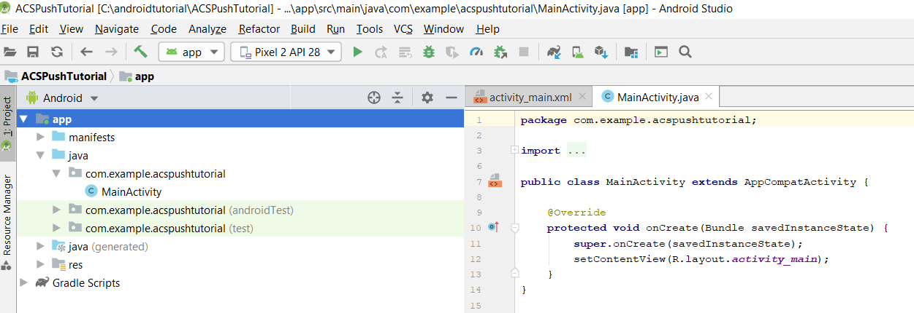
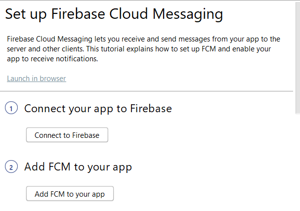

# Schritt 1: Erstellen der [!DNL Android]-App und Konfigurieren der Verwendung von [!DNL Firebase Cloud Messaging]

In diesem Teil erstellen Sie die [!DNL Android] App, um [!UICONTROL Push-Benachrichtigungen] von Adobe Campaign Standard zu erhalten. Um die Push-Benachrichtigungen zu erhalten, muss die App bei Google [!DNL Firebase Cloud Service] registriert sein.

1. Melden Sie sich bei Ihrem [!DNL Firebase] -Konto an.

   [!DNL Firebase] ist die mobile Plattform von Google, mit der Sie schnell hochwertige Apps entwickeln können. Wenn Sie kein [!DNL Firebase] -Konto haben, erstellen Sie hier ](https://firebase.google.com) ein [Konto.

2. Launch [!DNL Android Studio]
3. Klicken Sie auf **[!UICONTROL Datei]** > **[!UICONTROL Neu]** > **[!UICONTROL Neues Projekt].**
4. Wählen Sie **[!UICONTROL Leere Aktivität]** und klicken Sie auf **[!UICONTROL Weiter].**

   

5. Geben Sie einen aussagekräftigen Namen für das Projekt an.

   Für diese Demo haben wir unser Projekt als *[!DNL ACSPushTutorial]* bezeichnet.

   

6. Akzeptieren Sie die standardmäßigen Paketnamen und klicken Sie auf **[!DNL Finish]** , um Ihr Projekt zu erstellen.
7. Ihre Projektstruktur sollte dem folgenden Screenshot ähneln

   

8. Klicken Sie auf **[!UICONTROL Tools]** > **[!UICONTROL Firebase].** (Dadurch wird das Projekt zu [!DNL Firebase] hinzugefügt)
9. Klicken Sie auf **[!UICONTROL Firebase Cloud Messaging einrichten].**

   

10. Klicken Sie auf **[!UICONTROL Mit Firebase verbinden].**
11. Nachdem Ihre App mit Firebase verbunden ist, klicken Sie auf **[!UICONTROL FCM zu Ihrer App hinzufügen].**
12. Klicken Sie auf **[!UICONTROL Änderungen akzeptieren].**

   Wenn Sie FCM zu Ihrer App hinzufügen, benötigt der Assistent Ihre Berechtigung, um einige Änderungen an Ihrem Projekt vorzunehmen.

   ![[!DNL add-fcm-to-your-app]](assets/firebase-add-fcm-to-app.PNG)

Bei erfolgreicher Integration Ihrer App mit Firebase erhalten Sie eine Meldung wie die folgende:

![[!DNL fcm-successfull]](assets/android-firebase-success.PNG)

[Stellen Sie sicher, dass Ihr Projekt in der [!DNL Firebase ]Konsole](https://console.firebase.google.com/) aufgeführt ist.

## Einstellungen für [!UICONTROL Push-Kanal] konfigurieren

1. Bei der Konsole [!DNL Firebase] anmelden
2. Öffnen Sie das Projekt **[!UICONTROL ACSPushTutorial]** .
3. Klicken Sie auf das Zahnradsymbol **und öffnen Sie die Projekteinstellungen.**

   

4. Registerkarte zur Registerkarte **[!UICONTROL Cloud Messaging]** .
5. Kopieren des Serverschlüssels

   

6. Bei Ihrer Adobe Campaign Standard-Instanz anmelden
7. Klicken Sie auf **[!UICONTROL Adobe Campaign]** > **[!UICONTROL Administration]** > **[!UICONTROL Kanäle]** > **[!UICONTROL Mobile App].**
8. Wählen Sie die entsprechende **[!UICONTROL Eigenschaft der Mobile App].** aus.
9. Klicken Sie auf das Symbol **[!DNL Android]** im Abschnitt **[!UICONTROL Push Channel settings]** .
10. Fügen Sie den Serverschlüssel in das Feld für den Serverschlüssel ein.

Wenn alles gut läuft, sollte eine SUCCESS-Meldung angezeigt werden.

Zusammenfassend haben wir eine [!DNL Android App] erstellt und die [!DNL Android App] mit [!DNL Firebase] verbunden. Anschließend haben wir die Mobile App in Adobe Campaign mit dem [!DNL Android App] verbunden, indem wir den Serverschlüssel der [!DNL Android] App in die Mobile App in Adobe Campaign Standard eingefügt haben.
