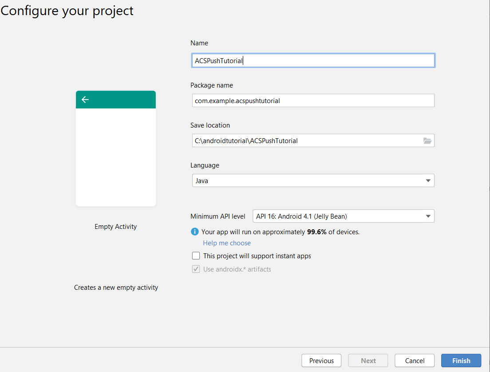

# Schritt 1: Erstellung [!DNL Android] App und Konfiguration der [!DNL Firebase Cloud Messaging]

In diesem Teil erstellen Sie [!DNL Android] App, um von Adobe Campaign Standard gesendete [!UICONTROL Push]Benachrichtigungen zu erhalten. Um die Push-Benachrichtigungen zu erhalten, muss die App bei der [!DNL Firebase Cloud Service] von Google registriert sein.

1. Beim [!DNL Firebase] Konto anmelden.

   [!DNL Firebase] ist die mobile Plattform von Google, mit der Sie schnell hochwertige Apps entwickeln können. Wenn Sie noch kein [!DNL Firebase] Konto haben, erstellen Sie bitte eines [von hier](https://firebase.google.com).

2. [!DNL Android Studio] starten
3. Klicken Sie auf **[!UICONTROL Datei]** > **[!UICONTROL Neu]** > **[!UICONTROL Neues Projekt].**
4. Wählen Sie **[!UICONTROL Leere Aktivität]** und klicken Sie auf **[!UICONTROL Weiter].**

   

5. Geben Sie dem Projekt einen aussagekräftigen Namen.

   Für diese Demo haben wir unser Projekt als *[!DNL ACSPushTutorial]* bezeichnet

   

6. Akzeptieren Sie die standardmäßigen Paketnamen und klicken Sie auf **[!DNL Finish]** , um Ihr Projekt zu erstellen.
7. Ihre Projektstruktur sollte der folgenden Abbildung ähneln

   

8. Klicken Sie **[!UICONTROL Tools]** > **[!UICONTROL Firebase].** (dadurch wird das Projekt zu [!DNL Firebase] hinzugefügt)
9. Klicken Sie **[!UICONTROL Firebase Cloud Messaging einrichten].**

   

10. Klicken Sie **[!UICONTROL Verbindung zu Firebase herstellen].**
11. Nachdem Ihre App mit Firebase verbunden ist, klicken Sie auf **[!UICONTROL FCM zu Ihrer App hinzufügen].**
12. Klicken Sie **[!UICONTROL Änderungen akzeptieren].**

   Wenn Sie FCM zu Ihrer App hinzufügen, benötigt der Assistent Ihre Berechtigung, um einige Änderungen an Ihrem Projekt vorzunehmen.

   ![[!DNL add-fcm-to-your-app]](assets/firebase-add-fcm-to-app.PNG)

Bei erfolgreicher Integration Ihrer App mit Firebase sollten Sie eine Nachricht wie die folgende erhalten:

![[!DNL fcm-successfull]](assets/android-firebase-success.PNG)

[Stellen Sie sicher, dass Ihr Projekt in der  [!DNL Firebase ] aufgeführt ist](https://console.firebase.google.com/)

## Einstellungen [!UICONTROL Push-Kanal] konfigurieren

1. Bei [!DNL Firebase] Console anmelden
2. Öffnen Sie das **[!UICONTROL ACSPushTutorial]**-Projekt.
3. Klicken Sie auf **Zahnradsymbol** und öffnen Sie die Projekteinstellungen

   

4. Wechseln Sie zur Registerkarte **[!UICONTROL Cloud Messaging]** .
5. Kopieren Sie den Server-Schlüssel

   

6. Bei Adobe Campaign Standard-Instanz anmelden
7. Klicken Sie auf **[!UICONTROL Adobe Campaign]** > **[!UICONTROL Administration]** > **[!UICONTROL Kanäle]** > **[!UICONTROL Mobile App].**
8. Wählen Sie die entsprechende **[!UICONTROL Eigenschaft der Mobile App].**
9. Klicken Sie auf das **[!DNL Android]-** im Abschnitt **[!UICONTROL Push-Kanaleinstellungen]**.
10. Fügen Sie den Server-Schlüssel in das Feld Server-Schlüssel ein.

Wenn alles gut geht, sollten Sie eine Erfolgsmeldung sehen.

Zusammenfassend lässt sich sagen, dass wir eine [!DNL Android App] erstellt und die [!DNL Android App] mit [!DNL Firebase] verbunden haben. Anschließend haben wir die Mobile App in Adobe Campaign mit dem [!DNL Android App] verbunden, indem wir den Serverschlüssel der [!DNL Android] App in die Mobile App in Adobe Campaign Standard eingefügt haben.
