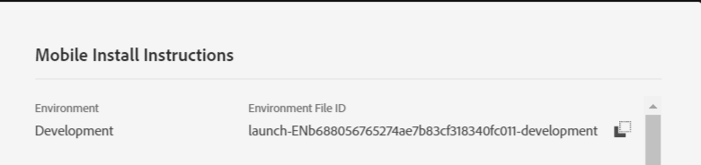

# Schritt 3: Registrieren der Erweiterungen für Ihre Mobile App

In diesem Teil fügen wir den Code hinzu, um die Erweiterungen Benutzerprofil, Identität, Lebenszyklus und Signal zu registrieren. Wir müssen auch die Adobe Campaign Standard-Erweiterung registrieren, wie im Code unten dargestellt.

Öffnen Sie Ihr Projekt in [!DNL Android] Studio. Löschen Sie den gesamten Code in MainApp **mit Ausnahme der ersten Zeile, die Ihre Paketanweisung**.

Fügen Sie den folgenden Code in MainApp ein

<!--
Removed `{.line-numbers}` below
-->

```java
import [!DNL android].app.Application;
import android.util.Log;

import com.adobe.marketing.mobile.AdobeCallback;
import com.adobe.marketing.mobile.Campaign;
import com.adobe.marketing.mobile.Identity;
import com.adobe.marketing.mobile.InvalidInitException;
import com.adobe.marketing.mobile.Lifecycle;
import com.adobe.marketing.mobile.LoggingMode;
import com.adobe.marketing.mobile.MobileCore;
import com.adobe.marketing.mobile.Signal;
import com.adobe.marketing.mobile.UserProfile;

public class MainApp extends Application {

@Override
public void onCreate() {
super.onCreate();

MobileCore.setApplication(this);
MobileCore.setLogLevel(LoggingMode.DEBUG);

try{
    Campaign.registerExtension();
    UserProfile.registerExtension();
    Identity.registerExtension();
    Lifecycle.registerExtension();
    Signal.registerExtension();
    MobileCore.start(new AdobeCallback () {
        @Override
        public void call(Object o) {
            MobileCore.configureWithAppID("copy your launch property id here");
        }
    });
} catch (InvalidInitException e) {
    Log.d("ACS Exception", "exception");
}
}
}
```

Zeile 32 Sie müssen die Umgebungsdatei[!UICONTROL ID Ihrer Launch]-Eigenschaft angeben. Der Zugriff kann über die Registerkarte [!UICONTROL Umgebung] der Eigenschaft [!UICONTROL Launch] erfolgen.


