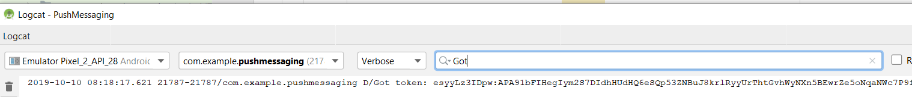

# Schritt 4: [!DNL pushidentifier] festlegen

Der **[!DNL pushidentifier]** ist eine Zeichenfolge, die das Geräte-Token für [!DNL Push]-Benachrichtigungen enthält. Es ist dasselbe Token, das von [!DNL Firebase] gesendet und mit der [!DNL MobileCore.setPushIdentifier]-Methode an den SDK übergeben wird.

Öffnen Sie Ihr Projekt in [!DNL Android™]studio. Löschen Sie den gesamten Code in [!DNL MainActivity] **mit Ausnahme der ersten Zeile, die Ihre Paketanweisung ist**.

Fügen Sie den folgenden Code in [!DNL MainActivity] ein:

<!--
Removed `{.line-numbers}` below
-->

```java
import androidx.annotation.NonNull;
import androidx.appcompat.app.AppCompatActivity;

import android.os.Bundle;
import android.util.Log;
import android.widget.Toast;

import com.adobe.marketing.mobile.MobileCore;
import com.google.android.gms.tasks.OnCompleteListener;
import com.google.android.gms.tasks.Task;
import com.google.firebase.iid.FirebaseInstanceId;
import com.google.firebase.iid.InstanceIdResult;

public class MainActivity extends AppCompatActivity {

@Override
protected void onCreate(Bundle savedInstanceState) {
super.onCreate(savedInstanceState);
setContentView(R.layout.activity_main);

registerToken();
}

void registerToken() {
FirebaseInstanceId.getInstance().getInstanceId()
    .addOnCompleteListener(new OnCompleteListener<InstanceIdResult>() {
        @Override
        public void onComplete(@NonNull Task<InstanceIdResult> task) {
            if (!task.isSuccessful()) {
                Log.w("Message App", "getInstanceId failed", task.getException());
                return;
            }

// Get new Instance ID token
String token = task.getResult().getToken();

Log.d("Got token", token);

MobileCore.setPushIdentifier(token);
}
});
}

@Override
public void onResume() {
super.onResume();
MobileCore.setApplication(getApplication());
MobileCore.lifecycleStart(null);
}

@Override
public void onPause() {
super.onPause();
MobileCore.lifecyclePause();
}
}
```

## Testen der App

Jetzt ist ein guter Zeitpunkt, um Ihre App zu testen, bevor Sie fortfahren.

* Führen Sie Ihre App aus, indem Sie auf den grünen Pfeil klicken oder **[!DNL Run->Run'app']** auswählen.
* Der [!DNL Android™]-Emulator sollte gestartet werden und die App sollte mit &quot;[!DNL "Hello World"]&quot; ausgeführt werden.
* Öffnen Sie das [!DNL logcat]. Suchen Sie nach &quot;[!DNL Got]&quot;. Sie sollten das Token sehen, das von [!DNL Firebase] empfangen wurde, das wie unten dargestellt in das Protokoll geschrieben wurde. Die lange Zeichenfolge nach &quot;[!DNL Got token]&quot; ist die [!DNL pushidentifier], die an Adobe Campaign gesendet wird.



### Mobile-App-Abonnenten überprüfen

Melden Sie sich bei Ihrer Adobe Campaign Standard-Instanz an.
Navigieren Sie **[!UICONTROL Administration->Kanäle->Mobile App (Experience Platform SDK)]**. Öffnen Sie die entsprechende Mobile App. Wechseln Sie zur Registerkarte [!UICONTROL Mobile-App-Abonnenten] . Es sollte ein „Registrierungs[!UICONTROL Token“ ] werden.


>[!NOTE]
>
>Wird das Anmelde-Token auf der Registerkarte [!UICONTROL Mobile-App-Abonnenten] hier nicht angezeigt, fahren Sie mit dem Vorgang fort.
